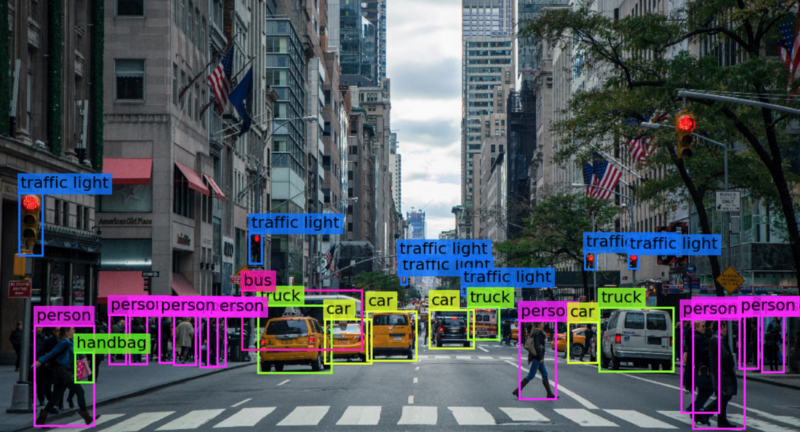
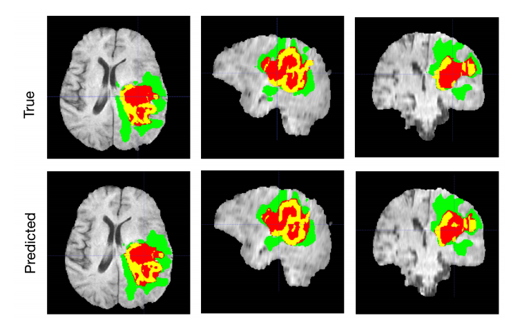
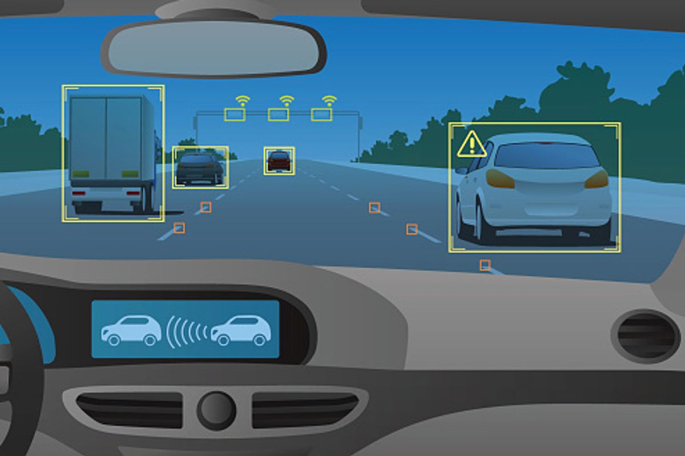
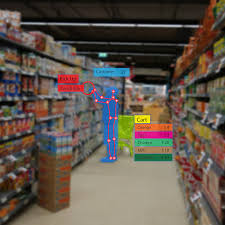
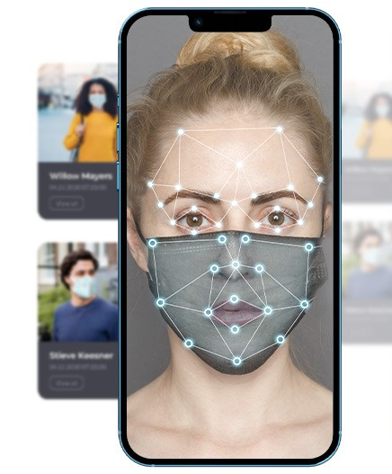

# AI Bauchi 6 Weeks Computer Vision Bootcamp

## Day 1: Introduction to Computer Vision and Python Basics

### Session 1: What is Computer Vision?

Welcome to Day 1 of our **Computer Vision Bootcamp!** Today, we will delve into the fundamentals of Computer Vision and set the stage for our journey ahead.

#### What is Computer Vision?
Computer Vision is the field of artificial intelligence focused on enabling machines to interpret and understand visual information from the world around us. It involves developing algorithms and models to extract meaningful insights from images and videos.

#### Historical Perspective:
Computer Vision has roots dating back to the 1960s when researchers first explored ways to teach computers to interpret visual data. Early applications were rudimentary, but over the decades, advancements in computing power and algorithms have accelerated its capabilities.

#### Applications of Computer Vision:
- **Healthcare:** Medical image analysis, disease diagnosis.

- **Automotive:** Self-driving cars, object detection, and navigation.

- **Retail:** Customer analytics, inventory management.

- **Security:** Surveillance, facial recognition.

- **Entertainment:** Augmented reality, gesture recognition.

- **other:** Education, Millitary, Exploration and many more

#### Importance in Modern Technology:
Computer Vision drives innovation across various industries, enhancing efficiency, accuracy, and automation. From enhancing medical diagnostics to enabling autonomous vehicles, its applications are vast and impactful.

### Next Steps:
In the upcoming sessions, we will:
- Explore Python basics for Computer Vision.
- Learn how to set up our development environment.
- Dive into practical exercises to apply these concepts.

---
**Additional Text**

**C**omputer Vision is a type of artificial intelligence (AI) that enables machines to interpret and understand the visual world. Computer Vision algorithms can analyse and extract information from images and videos, including objects, patterns, and facial features. 

Computer Vision is used in a wide range of applications, from self-driving cars to facial recognition systems. One of the most impressive examples is the use of Computer Vision in medical diagnosis, where machines are able to analyse medical images and detect early signs of disease. 

Computer Vision algorithms typically involve several key tasks, including object detection, image classification, and image segmentation. Object detection involves identifying the location and size of objects in an image, while image classification involves categorising images into different classes. Image segmentation involves separating an image into different regions based on visual cues like colour and texture. 

One of the key challenges in Computer Vision is the complexity and variability of the visual world. Objects can appear in different orientations, sizes, and lighting conditions, making it difficult for machines to identify and classify them accurately. Additionally, images can contain noise and other artifacts that can interfere with the algorithm's performance. 

Despite these challenges, Computer Vision is an important tool in the AI toolkit and has enabled many of the recent breakthroughs in AI. As AI continues to evolve, we can expect to see even more sophisticated Computer Vision models and applications in the future. 

In future articles, we'll dive deeper into some of the other AI terminologies, like Data Mining, Decision Trees, and Artificial Neural Networks. We'll explain what they are, how they work, and why they're important. By the end of this series, you'll have a solid understanding of the key concepts and ideas behind AI, and you'll be well-equipped to explore this exciting field further.

Read more at: https://yourstory.com/2023/04/ai-terminologies-101-understanding-computer-vision